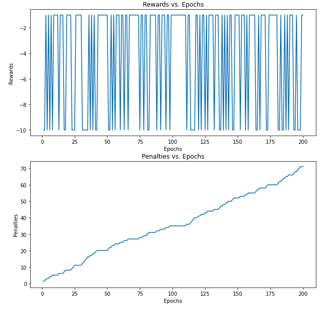
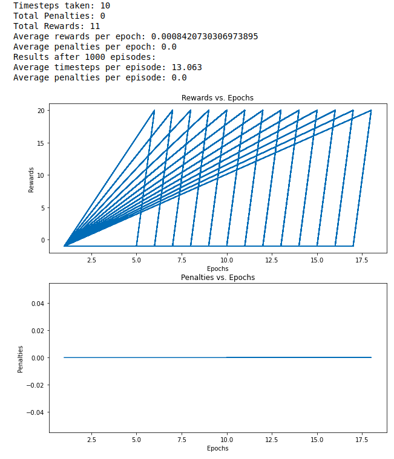

# Deep Reinforcement Learning (DRL)

DRL uses Deep Neural Networks to come up with best actions for the agent.  

The Markov Decision Process (MDP) is a mathematical formulation of the RL problem. The Markov Property states that the current state is fully representative of the state of the environment. Hence, the future is only dependent on the present.  

S - State Space  
A - Action Space   
R - Rewards for each pair of (S,A)  
P - Transition Probability  
Gamma - reward discount factor  

Gamma is between 0 and 1. A value of 1 for gamma means that immediate rewards are valued highest. A value of closer to 0 means that future rewards are valued highest.  

The objective of RL is to find an optimal policy that maximizes the cumulative discounted reward. A policy here is nothing else than a mapping of states to actions.  

Q-Learning is an off-policy algorithm for temporal difference (TD) learning which implies model free learning.

Q-Learning:  
    $$Q_{t+1}(s_t, a_t) = Q_{t}(s_t, a_t) + \alpha(r_{t+1} + \gamma max Q_{t}(s_{t+1},a) - Q_{t}(s_t, a_t)$$

Learning rate $\alpha$ specifies the learning rate for the agent of accepting new information over learnt information.  

Q-Learning Algorithm Steps:
- Initialize Q-Table with (s,a) all zeros per shape with size of states and actions
- Observe initial state s
- Perform action a
- Observe reward r and a new state $s_{t+1}$
- Update Q-Table with r and maximum reward from $s_{t+1}$

RL algorithms are based on exploration/exploitation concepts.  
Exploration is the finding of new information about the environment.  
Exploitation is the use of existing information to maximize the reward.  

 

 

DQN combines Q-Learning with a convolutional neural network to find the optimal Q-value function. DQN uses states as input and optimal Q-value of all possible actions as the output.  

In this instance of DQN, we are using a CNN. An image from the taxi game is fed to the CNN and it will output Q value of all of the actions in the state.  
 
CNN layers extract features from the image and produce a feature map. The flatten layer will flatten the feature map and feed it as an input to the feedforward network. The feedforward network takes this flattened feature map as an input and returns the Q value of all the actions in the state such as $Q(s,a_0),\, Q(s,a_1),\, Q(s,a_2) \, etc$.  

https://abedinsherifi.github.io/Deep_Reinforcement_Learning/
